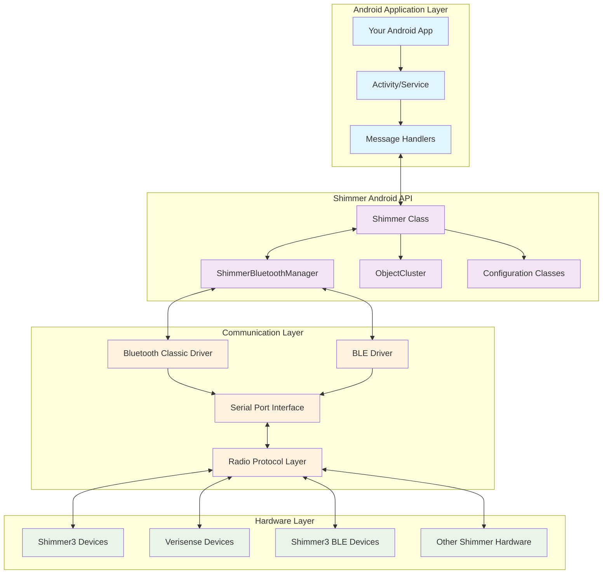
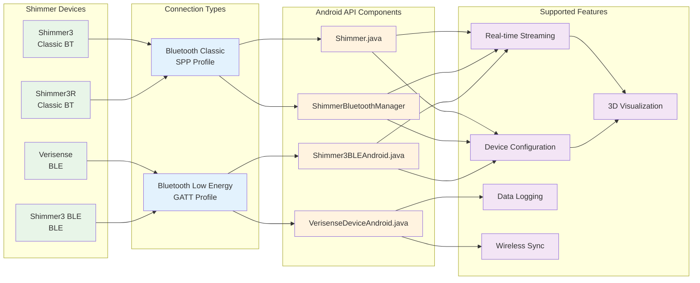
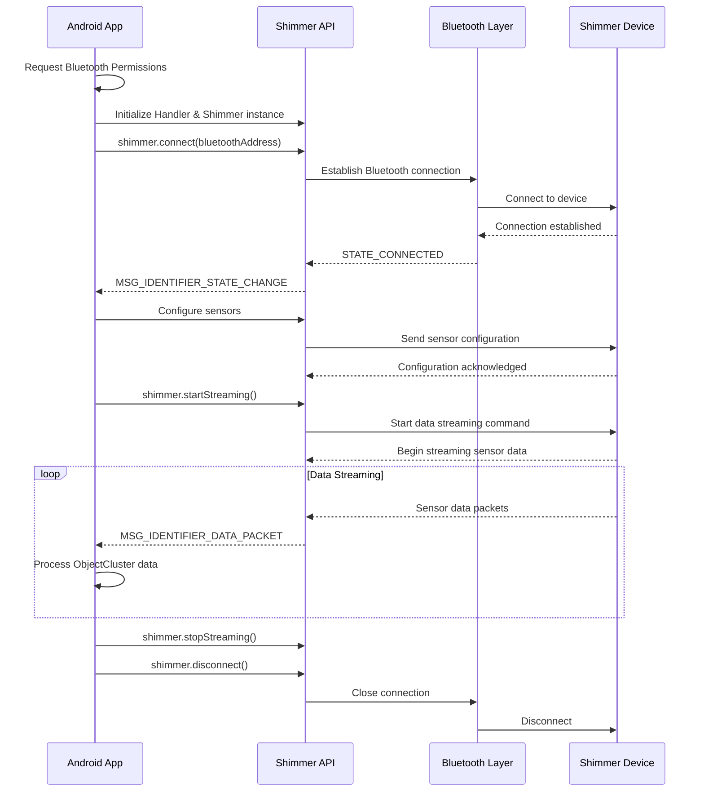
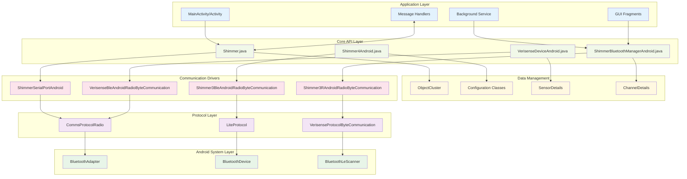
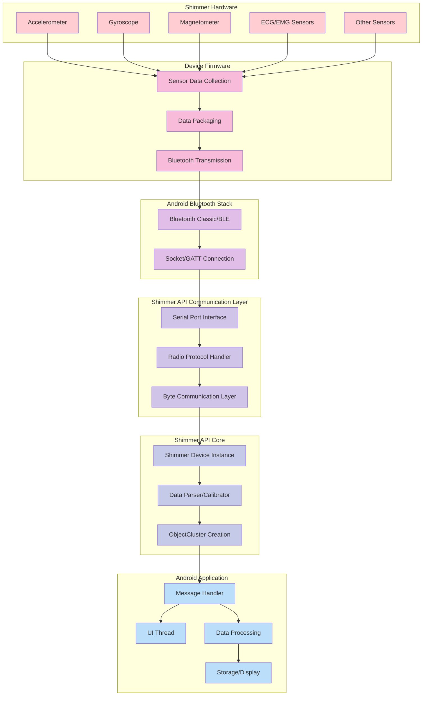
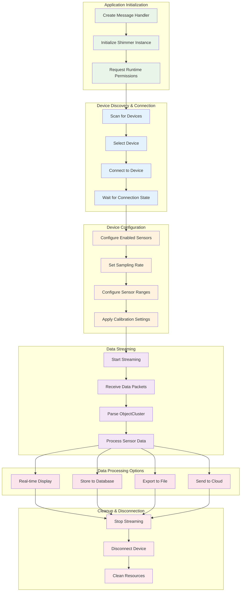
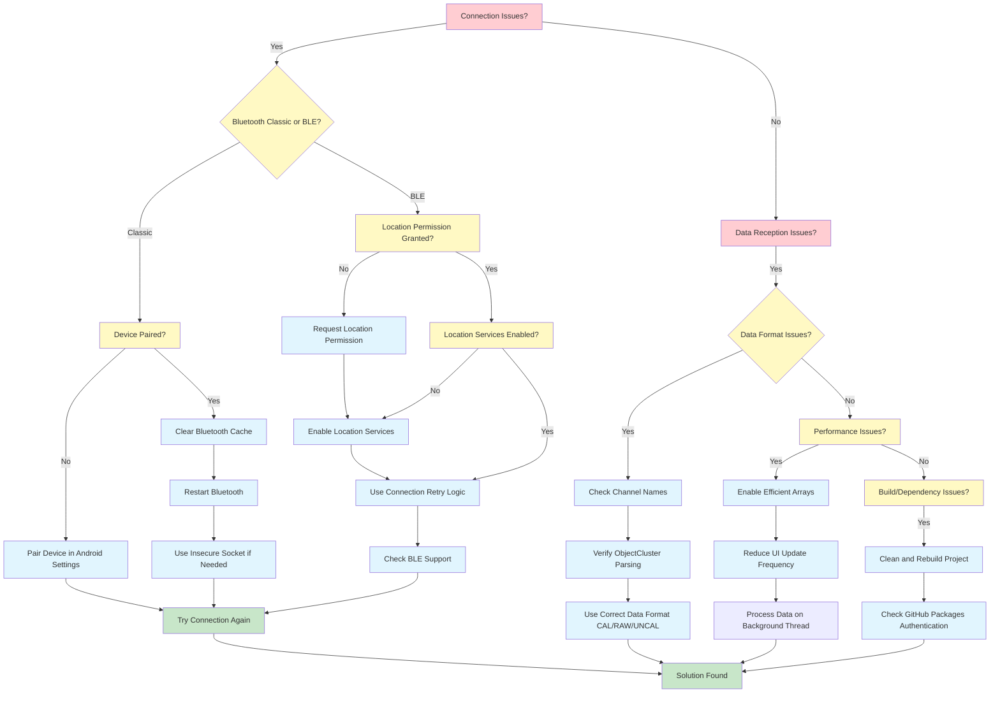

# Shimmer Android API

[](LICENSE)
[](https://developer.android.com)
[](https://github.com/ShimmerEngineering/ShimmerAndroidAPI/releases)
[]()

A comprehensive Android API for communicating with Shimmer wearable sensors via Bluetooth and BLE. This API enables real-time data streaming, device configuration, and data logging from Shimmer3, Verisense, and other Shimmer sensor platforms.

## Table of Contents

- [Overview](#overview)
- [Features](#features)
- [Supported Devices](#supported-devices)
- [Prerequisites](#prerequisites)
- [Installation](#installation)
- [Quick Start](#quick-start)
- [Project Structure](#project-structure)
- [Examples](#examples)
- [API Documentation](#api-documentation)
- [Migration Guide](#migration-guide)
- [Troubleshooting](#troubleshooting)
- [Contributing](#contributing)
- [License](#license)
- [Support](#support)

## Overview

Shimmer research sensors are wireless wearable devices that capture physiological and kinematic data in real-time. This Android API provides developers with the tools needed to:

- **Connect** to Shimmer devices via Bluetooth Classic or Bluetooth Low Energy (BLE)
- **Configure** sensor settings, sampling rates, and enabled sensors
- **Stream** real-time data from multiple sensors simultaneously
- **Log** data to device storage or sync from Verisense devices
- **Visualize** sensor data with built-in plotting capabilities
- **Calibrate** sensors for accurate measurements

The API supports a wide range of sensors including accelerometers, gyroscopes, magnetometers, ECG, EMG, GSR, and more.

### System Architecture



## Features

### 🔌 Connectivity
- **Bluetooth Classic** support for Shimmer3 devices
- **Bluetooth Low Energy (BLE)** support for newer devices
- **Multi-device** connection management
- **Automatic reconnection** capabilities
- **Connection state monitoring**

### 📊 Data Handling
- **Real-time streaming** with configurable sampling rates
- **Data synchronization** from Verisense devices
- **Multiple data formats** (calibrated/uncalibrated)
- **Efficient data structures** for high-performance applications
- **CSV logging** capabilities
- **Timestamp synchronization**

### ⚙️ Device Configuration
- **Sensor enable/disable** controls
- **Sampling rate** configuration
- **Calibration parameter** management
- **Battery monitoring**
- **Device information** retrieval
- **Firmware update** support

### 📱 Android Integration
- **Service-based architecture** for background operation
- **Fragment-based UI components** for easy integration
- **Handler-based messaging** for UI updates
- **Permission management** helpers
- **Android lifecycle** awareness

### 📈 Visualization & Analysis
- **Real-time plotting** with AndroidPlot integration
- **Signal selection** dialogs
- **3D orientation** visualization
- **Data export** functionality
- **Custom plot configurations**

## Supported Devices

| Device Family | Connectivity | Key Features |
|---------------|-------------|--------------|
| **Shimmer3** | Bluetooth Classic | IMU, ECG, EMG, GSR, customizable sensor configurations |
| **Shimmer3R** | Bluetooth Classic | Research-grade sensors, extended battery life |
| **Verisense** | Bluetooth Low Energy | Data logging, wireless sync, extended deployment |
| **Shimmer3 BLE** | Bluetooth Low Energy | Low power consumption, mobile integration |

### Device Compatibility Overview



## Prerequisites

### Development Environment
- **Android Studio** 2024.2.1 Patch 2 or later (recommended)
- **Android SDK** API Level 21 (Android 5.0) minimum
- **Java Development Kit (JDK)** 11 or higher
- **Gradle** 7.0.4 or compatible

### Runtime Requirements
- **Android OS** 5.0+ (API Level 21)
- **Bluetooth** hardware support
- **Bluetooth permissions** granted by user
- **Location permissions** (required for BLE scanning on Android 6.0+)

### Hardware Compatibility
- Shimmer devices with compatible firmware
- Android device with Bluetooth Classic or BLE support
- Sufficient device storage for data logging (if applicable)

## Installation

The Shimmer Android API uses GitHub Packages for dependency management. Follow these steps to integrate it into your Android project:

### 1. Configure GitHub Packages Access

Create or modify your `gradle.properties` file in your Gradle user home directory (e.g., `~/.gradle/gradle.properties` or `C:/Users/YourUsername/.gradle/gradle.properties`):

```properties
gpr.usr=YOUR_GITHUB_USERNAME
gpr.key=YOUR_PERSONAL_ACCESS_TOKEN
```

**Note**: Your Personal Access Token must have `read:packages` scope enabled. Generate one at [GitHub Developer Settings](https://github.com/settings/tokens).

### 2. Project-Level build.gradle

Add the following repositories to your project-level `build.gradle`:

```gradle
allprojects {
    repositories {
        google()
        mavenCentral()
        maven {
            name = "GitHubPackages"
            url = uri("https://maven.pkg.github.com/ShimmerEngineering/Shimmer-Java-Android-API")
            credentials {
                username = project.findProperty("gpr.usr") ?: System.getenv("USERNAME")
                password = project.findProperty("gpr.key") ?: System.getenv("TOKEN")
            }
        }
        maven {
            name = "GitHubPackages"
            url = uri("https://maven.pkg.github.com/ShimmerEngineering/ShimmerAndroidAPI")
            credentials {
                username = project.findProperty("gpr.usr") ?: System.getenv("USERNAME")
                password = project.findProperty("gpr.key") ?: System.getenv("TOKEN")
            }
        }
        maven { url 'https://jitpack.io' }
    }
}
```

### 3. App-Level build.gradle

Add the dependencies to your app-level `build.gradle`:

```gradle
dependencies {
    // Core Shimmer libraries
    implementation (group: 'com.shimmerresearch', name: 'shimmerbluetoothmanager', version:'0.11.3_beta') {
        exclude group: 'io.netty'
        exclude group: 'com.google.protobuf'
        exclude group: 'org.apache.commons.math'
    }
    
    implementation (group: 'com.shimmerresearch', name: 'shimmerdriver', version:'0.11.3_beta') {
        exclude group: 'io.netty'
        exclude group: 'com.google.protobuf'
    }
    
    // Additional dependencies for visualization and utilities
    implementation 'com.google.guava:guava:20.0'
    implementation 'java3d:vecmath:1.3.1'
    implementation 'com.android.support:appcompat-v7:26.1.0'
    implementation 'com.github.Jasonchenlijian:FastBle:2.4.0'
}
```

### 4. Android Manifest Permissions

Add required permissions to your `AndroidManifest.xml`:

```xml
<!-- Bluetooth permissions -->
<uses-permission android:name="android.permission.BLUETOOTH" />
<uses-permission android:name="android.permission.BLUETOOTH_ADMIN" />

<!-- For Android 12+ (API level 31+) -->
<uses-permission android:name="android.permission.BLUETOOTH_CONNECT" />
<uses-permission android:name="android.permission.BLUETOOTH_SCAN" />

<!-- Location permissions (required for BLE scanning) -->
<uses-permission android:name="android.permission.ACCESS_FINE_LOCATION" />
<uses-permission android:name="android.permission.ACCESS_COARSE_LOCATION" />

<!-- Storage permissions (for data logging) -->
<uses-permission android:name="android.permission.WRITE_EXTERNAL_STORAGE" />
<uses-permission android:name="android.permission.READ_EXTERNAL_STORAGE" />
```

## Quick Start

### Connection Setup Flow



### Basic Implementation Example

Here's a minimal example to connect to a Shimmer device and start streaming data:

```java
import com.shimmerresearch.android.Shimmer;
import com.shimmerresearch.driver.Configuration;
import com.shimmerresearch.driver.ObjectCluster;

public class QuickStartExample extends Activity {
    private Shimmer shimmerDevice;
    private Handler messageHandler;
    
    @Override
    protected void onCreate(Bundle savedInstanceState) {
        super.onCreate(savedInstanceState);
        
        // Initialize message handler for receiving data
        messageHandler = new Handler(Looper.getMainLooper()) {
            @Override
            public void handleMessage(Message msg) {
                switch (msg.what) {
                    case ShimmerBluetooth.MSG_IDENTIFIER_DATA_PACKET:
                        ObjectCluster objectCluster = (ObjectCluster) msg.obj;
                        // Process sensor data here
                        processSensorData(objectCluster);
                        break;
                        
                    case ShimmerBluetooth.MSG_IDENTIFIER_STATE_CHANGE:
                        ShimmerBluetooth.BT_STATE state = null;
                        if (msg.obj instanceof ObjectCluster) {
                            state = ((ObjectCluster) msg.obj).mState;
                        }
                        handleStateChange(state);
                        break;
                }
            }
        };
        
        // Initialize Shimmer device
        shimmerDevice = new Shimmer(messageHandler);
    }
    
    private void connectToDevice(String bluetoothAddress) {
        // Connect to the Shimmer device
        shimmerDevice.connect(bluetoothAddress, "default");
    }
    
    private void startStreaming() {
        // Configure sensors (enable accelerometer)
        shimmerDevice.writeEnabledSensors(Configuration.Shimmer3.SensorMap.A_ACCEL);
        
        // Start data streaming
        shimmerDevice.startStreaming();
    }
    
    private void processSensorData(ObjectCluster objectCluster) {
        // Extract accelerometer data
        Collection<FormatCluster> accelX = objectCluster.getCollectionOfFormatClusters("Low Noise Accelerometer X");
        Collection<FormatCluster> accelY = objectCluster.getCollectionOfFormatClusters("Low Noise Accelerometer Y");
        Collection<FormatCluster> accelZ = objectCluster.getCollectionOfFormatClusters("Low Noise Accelerometer Z");
        
        // Process the data as needed
        if (!accelX.isEmpty()) {
            double xValue = ((FormatCluster) accelX.iterator().next()).mData;
            Log.d("Shimmer", "Accel X: " + xValue);
        }
    }
    
    private void handleStateChange(ShimmerBluetooth.BT_STATE state) {
        switch (state) {
            case CONNECTED:
                Log.d("Shimmer", "Device connected");
                break;
            case STREAMING:
                Log.d("Shimmer", "Device streaming");
                break;
            case DISCONNECTED:
                Log.d("Shimmer", "Device disconnected");
                break;
        }
    }
}
```

## Project Structure

The Shimmer Android API consists of several modules and example applications:

```
ShimmerAndroidAPI/
├── ShimmerAndroidInstrumentDriver/          # Main API module
│   ├── ShimmerAndroidInstrumentDriver/      # Core library sources
│   ├── bluetoothManagerExample/             # Bluetooth connection management
│   ├── efficientDataArrayExample/           # High-performance data handling
│   ├── shimmer3DOrientationExample/         # 3D orientation visualization
│   ├── shimmerBasicExample/                 # Basic connection and streaming
│   ├── shimmerLegacyExample/                # Legacy Shimmer2 support
│   ├── shimmerServiceExample/               # Service-based architecture
│   ├── verisenseBLEBasicExample/           # Verisense BLE integration
│   ├── shimmer3BLEBasicExample/            # Shimmer3 BLE support
│   └── multiverisenseblebasicexample/      # Multiple Verisense devices
├── Changelog.md                             # Version history
├── License                                  # BSD-3-Clause license
└── README.md                               # This file
```

### Core Components

| Component | Description |
|-----------|-------------|
| **ShimmerAndroidInstrumentDriver** | Main library containing Shimmer classes, Bluetooth managers, and device drivers |
| **Configuration Classes** | Device-specific sensor configurations and calibration parameters |
| **ObjectCluster** | Data container for sensor readings with timestamp and format information |
| **ShimmerService** | Background service for managing multiple device connections |
| **GUI Utilities** | Pre-built fragments and dialogs for device management |

### Software Architecture Diagram



## Examples

### 1. Bluetooth Manager Example
**Purpose**: Demonstrates connection management with multiple devices  
**Devices**: Shimmer3+ devices  
**Features**: Device pairing, connection state monitoring, basic data streaming

```bash
# Location
ShimmerAndroidInstrumentDriver/bluetoothManagerExample/
```

**Key Features**:
- Device scanning and pairing
- Connection state visualization
- Support for both BLE and Bluetooth Classic
- Permission handling examples

### 2. Shimmer Basic Example  
**Purpose**: Simple direct connection without Bluetooth Manager  
**Devices**: Shimmer3+ devices  
**Features**: Direct device connection, basic sensor configuration

```bash
# Location  
ShimmerAndroidInstrumentDriver/shimmerBasicExample/
```

**Key Features**:
- Minimal setup required
- Direct Shimmer class usage
- Pre-configured device assumption
- Low Noise Accelerometer streaming

### 3. Shimmer Service Example
**Purpose**: Production-ready service-based architecture  
**Devices**: Shimmer3+ and Verisense devices  
**Features**: Background operation, device configuration UI, data plotting

```bash
# Location
ShimmerAndroidInstrumentDriver/shimmerServiceExample/
```

**Key Features**:
- Multi-device connection management
- Device configuration interface
- Real-time data plotting
- Data sync for Verisense devices
- Background service operation

### 4. Efficient Data Array Example
**Purpose**: High-performance data handling for resource-constrained environments  
**Devices**: All supported devices  
**Features**: Optimized data structures, improved packet reception rates

```bash
# Location
ShimmerAndroidInstrumentDriver/efficientDataArrayExample/
```

**Key Features**:
- Alternative Arrays data structure
- Improved performance on older devices
- Reduced memory overhead
- Channel indexing utilities

### 5. 3D Orientation Example
**Purpose**: 3D visualization of device orientation using OpenGL  
**Devices**: Shimmer3+ with IMU sensors  
**Features**: Real-time 3D cube rotation, orientation calibration

```bash
# Location
ShimmerAndroidInstrumentDriver/shimmer3DOrientationExample/
```

**Key Features**:
- OpenGL ES rendering
- Real-time orientation updates
- Calibration controls
- Matrix transformations

### 6. Verisense BLE Examples
**Purpose**: Specialized examples for Verisense devices  
**Devices**: Verisense with BLE support  
**Features**: Data synchronization, device configuration, multi-device support

```bash
# Locations
ShimmerAndroidInstrumentDriver/verisenseBLEBasicExample/
ShimmerAndroidInstrumentDriver/multiverisenseblebasicexample/
```

**Key Features**:
- BLE connection management
- Data sync from device storage
- Multiple device handling
- Battery monitoring

## API Documentation

### Data Flow Architecture



### Core Classes

#### Shimmer
The main class for device communication and control.

```java
// Constructor
Shimmer shimmer = new Shimmer(Handler messageHandler);

// Connection methods
shimmer.connect(String bluetoothAddress, String connectionType);
shimmer.disconnect();

// Configuration methods
shimmer.writeEnabledSensors(long enabledSensors);
shimmer.writeSamplingRate(double samplingRate);
shimmer.writeAccelRange(int accelRange);
shimmer.writeGyroRange(int gyroRange);

// Streaming control
shimmer.startStreaming();
shimmer.stopStreaming();

// Device information
String deviceName = shimmer.getDeviceName();
String firmwareVersion = shimmer.getFirmwareVersionFullName();
double batteryVoltage = shimmer.getBattVoltage();
```

#### ObjectCluster
Container for sensor data with timestamp and formatting information.

```java
// Data retrieval methods
Collection<FormatCluster> data = objectCluster.getCollectionOfFormatClusters("Channel Name");
Object value = objectCluster.getFormatClusterValue("Channel Name", "Format");
double[] dataArray = objectCluster.sensorDataArray.mData;  // Efficient arrays structure

// Timestamp information
double timestamp = objectCluster.getTimestampUnix();
String bluetoothAddress = objectCluster.getMacAddress();
```

#### ShimmerBluetoothManager
High-level manager for multiple device connections.

```java
// Manager initialization
ShimmerBluetoothManager btManager = new ShimmerBluetoothManager(this, mHandler);

// Device management
btManager.connectShimmerThroughBTAddress(bluetoothAddress);
btManager.disconnectShimmer(bluetoothAddress);
btManager.startStreamingAllDevices();
btManager.stopStreamingAllDevices();

// State queries
Map<String, Shimmer> connectedDevices = btManager.getMapOfConnectedDevices();
boolean isConnected = btManager.isDeviceConnected(bluetoothAddress);
```

#### Configuration Constants
Device-specific sensor and configuration constants.

```java
// Shimmer3 sensor enable bits
Configuration.Shimmer3.SensorMap.A_ACCEL          // Low noise accelerometer
Configuration.Shimmer3.SensorMap.GYRO             // Gyroscope
Configuration.Shimmer3.SensorMap.MAG              // Magnetometer
Configuration.Shimmer3.SensorMap.BATTERY          // Battery voltage
Configuration.Shimmer3.SensorMap.EXT_EXP_A_A12    // External ADC A12
Configuration.Shimmer3.SensorMap.EXT_EXP_A_A13    // External ADC A13
Configuration.Shimmer3.SensorMap.EXT_EXP_A_A14    // External ADC A14

// Sampling rates
Configuration.Shimmer3.SENSOR_ACCEL.SAMPLING_RATE_51_2_HZ
Configuration.Shimmer3.SENSOR_ACCEL.SAMPLING_RATE_102_4_HZ
Configuration.Shimmer3.SENSOR_ACCEL.SAMPLING_RATE_204_8_HZ
```

### Message Handling

The API uses Android's Handler/Message system for asynchronous communication:

```java
private Handler messageHandler = new Handler(Looper.getMainLooper()) {
    @Override
    public void handleMessage(Message msg) {
        switch (msg.what) {
            case ShimmerBluetooth.MSG_IDENTIFIER_DATA_PACKET:
                // Handle incoming sensor data
                ObjectCluster cluster = (ObjectCluster) msg.obj;
                processData(cluster);
                break;
                
            case ShimmerBluetooth.MSG_IDENTIFIER_STATE_CHANGE:
                // Handle connection state changes
                ShimmerBluetooth.BT_STATE state = null;
                String macAddress = "";
                
                if (msg.obj instanceof ObjectCluster) {
                    state = ((ObjectCluster) msg.obj).mState;
                    macAddress = ((ObjectCluster) msg.obj).getMacAddress();
                } else if (msg.obj instanceof CallbackObject) {
                    state = ((CallbackObject) msg.obj).mState;
                    macAddress = ((CallbackObject) msg.obj).mBluetoothAddress;
                }
                
                switch (state) {
                    case CONNECTED:
                        onDeviceConnected(macAddress);
                        break;
                    case STREAMING:
                        onStreamingStarted(macAddress);
                        break;
                    case DISCONNECTED:
                        onDeviceDisconnected(macAddress);
                        break;
                }
                break;
                
            case Shimmer.MESSAGE_TOAST:
                // Handle status messages
                String message = msg.getData().getString(Shimmer.TOAST);
                Toast.makeText(context, message, Toast.LENGTH_SHORT).show();
                break;
        }
    }
};
```

### API Usage Workflow



### Sensor Channel Names

Common sensor channel names for data retrieval:

| Sensor | Channel Names |
|--------|---------------|
| **Accelerometer** | "Low Noise Accelerometer X/Y/Z" |
| **Gyroscope** | "Gyroscope X/Y/Z" |
| **Magnetometer** | "Magnetometer X/Y/Z" |
| **ECG** | "ECG LL-RA", "ECG LA-RA" |
| **EMG** | "EMG CH1", "EMG CH2" |
| **GSR** | "GSR", "GSR Conductance" |
| **Battery** | "VSenseBatt" |
| **Timestamp** | "Timestamp" |

### Data Formats

Sensor data is available in multiple formats:

- **CAL**: Calibrated data in engineering units
- **UNCAL**: Uncalibrated raw ADC values  
- **RAW**: Raw digital values from sensors

```java
// Retrieve calibrated accelerometer data in m/s²
double accelX = (Double) objectCluster.getFormatClusterValue("Low Noise Accelerometer X", "CAL");

// Retrieve raw ADC values
double rawAccelX = (Double) objectCluster.getFormatClusterValue("Low Noise Accelerometer X", "RAW");
```

## Migration Guide

### From JFrog/Bintray to GitHub Packages

If you're migrating from older versions that used JFrog or Bintray repositories:

#### 1. Update Repository Configuration

**Old (JFrog)**:
```gradle
repositories {
    maven {
        url 'https://shimmersensing.jfrog.io/artifactory/ShimmerAPI'
    }
}
```

**Old (Bintray - Deprecated)**:
```gradle
repositories {
    maven {
        url "http://dl.bintray.com/shimmerengineering/Shimmer"
    }
}
```

**New (GitHub Packages)**:
```gradle
repositories {
    maven {
        name = "GitHubPackages"
        url = uri("https://maven.pkg.github.com/ShimmerEngineering/Shimmer-Java-Android-API")
        credentials {
            username = project.findProperty("gpr.usr") ?: System.getenv("USERNAME")
            password = project.findProperty("gpr.key") ?: System.getenv("TOKEN")
        }
    }
}
```

#### 2. Update Dependency Declarations

**Old**:
```gradle
compile 'ShimmerAndroidInstrumentDriver:ShimmerAndroidInstrumentDriver:3.0.69Beta_AA-245_AA-246'
```

**New**:
```gradle
implementation (group: 'com.shimmerresearch', name: 'shimmerbluetoothmanager', version:'0.11.3_beta') {
    exclude group: 'io.netty'
    exclude group: 'com.google.protobuf'
    exclude group: 'org.apache.commons.math'
}
```

### API Version Migration

#### From v2.x to v3.x

**Handler Message Changes**:

| Deprecated (v2.x) | Updated (v3.x) |
|-------------------|----------------|
| `Shimmer.MESSAGE_STATE_CHANGE` | `ShimmerBluetooth.MSG_IDENTIFIER_STATE_CHANGE` |
| `Shimmer.MESSAGE_READ` | `ShimmerBluetooth.MSG_IDENTIFIER_DATA_PACKET` |
| `Shimmer.MSG_STATE_FULLY_INITIALIZED` | Use `BT_STATE.CONNECTED` |
| `Shimmer.STATE_CONNECTING` | Use `BT_STATE.CONNECTING` |
| `Shimmer.STATE_CONNECTED` | Use `BT_STATE.CONNECTED` |

**Updated State Handling**:
```java
// Old way (v2.x)
case Shimmer.MESSAGE_STATE_CHANGE:
    int state = msg.arg1;
    if (state == Shimmer.STATE_CONNECTED) {
        // Handle connection
    }
    break;

// New way (v3.x)
case ShimmerBluetooth.MSG_IDENTIFIER_STATE_CHANGE:
    ShimmerBluetooth.BT_STATE state = null;
    if (msg.obj instanceof ObjectCluster) {
        state = ((ObjectCluster) msg.obj).mState;
    }
    
    switch (state) {
        case CONNECTED:
            // Handle connection
            break;
        case STREAMING:
            // Handle streaming
            break;
    }
    break;
```

### Android Version Compatibility

#### Android 12+ (API Level 31+)

New Bluetooth permissions required:
```xml
<uses-permission android:name="android.permission.BLUETOOTH_CONNECT" />
<uses-permission android:name="android.permission.BLUETOOTH_SCAN" />
```

Runtime permission requests:
```java
if (Build.VERSION.SDK_INT >= Build.VERSION_CODES.S) {
    if (ContextCompat.checkSelfPermission(this, Manifest.permission.BLUETOOTH_CONNECT) 
        != PackageManager.PERMISSION_GRANTED) {
        ActivityCompat.requestPermissions(this, 
            new String[]{Manifest.permission.BLUETOOTH_CONNECT}, 
            REQUEST_BLUETOOTH_PERMISSIONS);
    }
}
```

## Troubleshooting

### Troubleshooting Flowchart



### Common Connection Issues

#### Bluetooth Classic Connection Problems

**Problem**: Device fails to connect or connects intermittently.

**Solutions**:
1. Ensure device is paired in Android Bluetooth settings
2. Clear Bluetooth cache: Settings → Apps → Bluetooth → Storage → Clear Cache
3. Use insecure connection for devices that don't require PIN:
   ```java
   shimmer.setUseInsecureRfcommSocket(true);
   ```
4. Restart Bluetooth adapter:
   ```java
   BluetoothAdapter.getDefaultAdapter().disable();
   // Wait 2 seconds
   BluetoothAdapter.getDefaultAdapter().enable();
   ```

#### BLE Connection Issues

**Problem**: BLE devices not discovered or connection drops frequently.

**Solutions**:
1. Ensure location permissions are granted
2. Enable location services
3. Check if device supports BLE
4. Implement connection retry logic
5. Use appropriate connection parameters for your use case

### Permission Issues

#### Location Permissions for BLE

**Problem**: "Need location access to scan for devices" error.

**Solution**: Request location permissions:
```java
if (ContextCompat.checkSelfPermission(this, Manifest.permission.ACCESS_FINE_LOCATION) 
    != PackageManager.PERMISSION_GRANTED) {
    ActivityCompat.requestPermissions(this, 
        new String[]{Manifest.permission.ACCESS_FINE_LOCATION}, 
        REQUEST_LOCATION_PERMISSIONS);
}
```

### Data Reception Issues

#### Missing Data Packets

**Problem**: Data packets are lost or received intermittently.

**Solutions**:
1. Use efficient data arrays for better performance:
   ```java
   shimmer.enableArraysDataStructure(true);
   ```
2. Reduce sampling rate if data loss occurs
3. Ensure UI updates don't block the handler thread
4. Consider using background service for data processing

#### Incorrect Sensor Data

**Problem**: Sensor readings seem incorrect or out of range.

**Solutions**:
1. Verify sensor calibration parameters
2. Check if correct sensors are enabled
3. Ensure proper sensor range configuration
4. Verify channel names match expected sensors

### Build Issues

#### GitHub Packages Authentication

**Problem**: "Could not resolve dependencies" with GitHub Packages.

**Solutions**:
1. Verify GitHub credentials in `gradle.properties`
2. Ensure Personal Access Token has `read:packages` scope
3. Check network connectivity to GitHub
4. Try clearing Gradle cache: `./gradlew clean build --refresh-dependencies`

#### Dependency Conflicts

**Problem**: Build fails due to conflicting dependencies.

**Solutions**:
1. Use provided exclusions in dependency declarations
2. Check for duplicate dependencies in different modules
3. Update to compatible library versions
4. Use `./gradlew dependencies` to analyze dependency tree

### Performance Issues

#### High CPU Usage

**Problem**: App consumes too much CPU during data streaming.

**Solutions**:
1. Enable efficient arrays data structure
2. Reduce UI update frequency
3. Process data on background thread
4. Implement data buffering
5. Reduce sampling rate if possible

#### Memory Leaks

**Problem**: Memory usage increases over time.

**Solutions**:
1. Ensure proper cleanup in Activity/Fragment lifecycle
2. Remove handler callbacks in `onDestroy()`
3. Disconnect devices when not needed
4. Use weak references for long-lived objects

## Contributing

We welcome contributions to improve the Shimmer Android API! Here's how you can help:

### Development Setup

1. **Fork** the repository
2. **Clone** your fork locally
3. **Set up** development environment:
   - Android Studio 2024.2.1 Patch 2+
   - JDK 11+
   - Android SDK with API 21+

### Contribution Guidelines

#### Code Style
- Follow Android coding conventions
- Use meaningful variable and method names
- Add Javadoc comments for public APIs
- Maintain consistent formatting

#### Testing
- Test your changes on multiple Android devices
- Verify backward compatibility
- Include example usage in documentation
- Test with different Shimmer device types

#### Pull Request Process

1. **Create** a feature branch from `master`
2. **Make** your changes with clear, atomic commits
3. **Update** documentation if needed
4. **Test** thoroughly on real devices
5. **Submit** pull request with detailed description

#### Bug Reports

When reporting bugs, please include:
- Android version and device model
- Shimmer device type and firmware version
- Steps to reproduce the issue
- Expected vs actual behavior
- Relevant log output

#### Feature Requests

For new features, please:
- Check existing issues first
- Provide clear use case description
- Include mockups or examples if applicable
- Discuss implementation approach

### Areas for Contribution

- **Documentation improvements**
- **Additional example applications**
- **Performance optimizations**
- **Bug fixes and stability improvements**
- **Support for new Shimmer devices**
- **Android version compatibility updates**

## License

This project is licensed under the BSD-3-Clause License. See the [LICENSE](LICENSE) file for details.

```
Copyright (c) 2017, Shimmer Research, Ltd. All rights reserved

Redistribution and use in source and binary forms, with or without 
modification, are permitted provided that the following conditions are met:

* Redistributions of source code must retain the above copyright notice, 
  this list of conditions and the following disclaimer.
* Redistributions in binary form must reproduce the above copyright notice, 
  this list of conditions and the following disclaimer in the documentation 
  and/or other materials provided with the distribution.
* Neither the name of Shimmer Research, Ltd. nor the names of its contributors 
  may be used to endorse or promote products derived from this software 
  without specific prior written permission.
```

## Support

### Documentation Resources

- **[Wiki](https://github.com/ShimmerEngineering/ShimmerAndroidAPI/wiki)**: Comprehensive guides and tutorials
- **[Quick Start Guide](https://github.com/ShimmerEngineering/ShimmerAndroidAPI/wiki/Quick-Start-Guide)**: Get up and running quickly
- **[Android Studio Setup](https://github.com/ShimmerEngineering/ShimmerAndroidAPI/wiki/Guide-for-Android-Studio-2024.2.1-Patch-2)**: IDE configuration guide
- **[Shimmer3R Integration](https://github.com/ShimmerEngineering/ShimmerAndroidAPI/wiki/Shimmer3R-Integration-Notes)**: Device-specific information

### Getting Help

- **GitHub Issues**: [Report bugs or request features](https://github.com/ShimmerEngineering/ShimmerAndroidAPI/issues)
- **Discussions**: [Community discussions and Q&A](https://github.com/ShimmerEngineering/ShimmerAndroidAPI/discussions)
- **Shimmer Support**: [Contact official support](https://www.shimmersensing.com/support/)

### Community

- **GitHub Releases**: [Latest versions and changelogs](https://github.com/ShimmerEngineering/ShimmerAndroidAPI/releases)
- **Shimmer Website**: [Official product information](https://www.shimmersensing.com/)
- **Developer Forum**: [Community discussions](https://www.shimmersensing.com/support/wireless-sensor-networks-forum/)

### Version Information

- **Current Version**: Check [releases page](https://github.com/ShimmerEngineering/ShimmerAndroidAPI/releases)
- **Development Status**: BETA - Active development with regular updates
- **Compatibility**: Android 5.0+ (API Level 21)
- **Last Updated**: See commit history for latest changes

---

> **Note**: This API is currently in BETA status. While stable for production use, APIs may change between releases. Please check the changelog and migration guide when updating versions.

For the most up-to-date information, examples, and detailed guides, please visit our [Wiki](https://github.com/ShimmerEngineering/ShimmerAndroidAPI/wiki).


